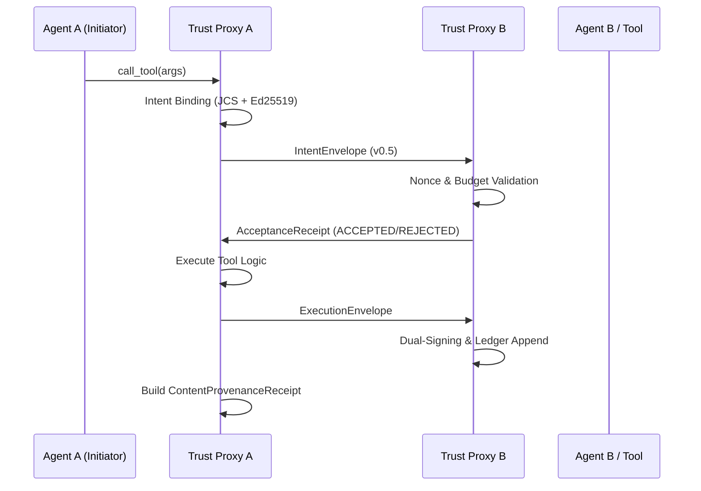

# trust-agent-core — Internal Architecture

This document describes the internal design of the `@trustagentai/a2a-core` library and its role in the Execution Accountability Layer.

---

## 1. System Overview

The core library transforms ephemeral MCP (Model Context Protocol) interactions into mathematically provable, legally significant records.

### Key Abstractions
- **`ProxyAGateway`**: Orchestrates the outbound handshake, from Intent formation to Execution delivery.
- **`ProxyBGateway`**: Handles inbound validation, policy enforcement (Risk Budget), and dual-signing of results.
- **`DAGLedger`**: A tamper-evident local registry structured as a Directed Acyclic Graph, supporting Merkle batching.
- **`NonceRegistry`**: Anti-replay mechanism with TTL and clock-skew tolerance.

---

## 2. Transaction Lifecycle (3-Phase Handshake)

The library enforces a strict protocol sequence to guarantee non-repudiation.

---

## 3. Cryptographic Standards

### JCS Canonicalization (RFC 8785)
All hashing operations utilize the JSON Canonicalization Scheme. This ensures that the same logical payload always produces the same hash, regardless of key order or whitespace in the source JSON.

### Ed25519 Signing
Identity is grounded in Ed25519 key pairs. The `ProxyBGateway` uses a peer key registry to verify inbound packets.

---

## 4. Streaming DAG Ledger & Merkle Anchoring

### Persistence Model
Records are stored in a DAG structure where each entry (Intent, Acceptance, Execution) references its causal parent.

### Batching for L2
The library supports batching ledger entries into Merkle Trees. The resulting Merkle Root is intended for on-chain notarization (e.g., via the `bank-b-anchor` service in the demo), providing an immutable timestamp for the entire batch.

---

## 5. Security Invariants

1. **TTL Check**: Envelopes with an `expires_at` in the past are rejected.
2. **Signature Binding**: The signature covers the JCS hash of the entire envelope payload (excluding the signature field itself).
3. **Budget Enforcement**: The `RiskBudgetEngine` prevents agents from autonomously overspending their allocated daily or per-transaction limits.
4. **D1 Non-repudiation**: Execution results are only considered final after being signed by both the initiator's proxy (on behalf of the agent) and the respondent's proxy.
